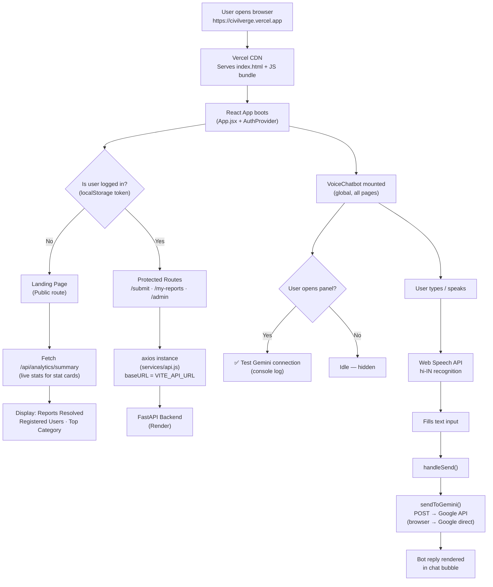
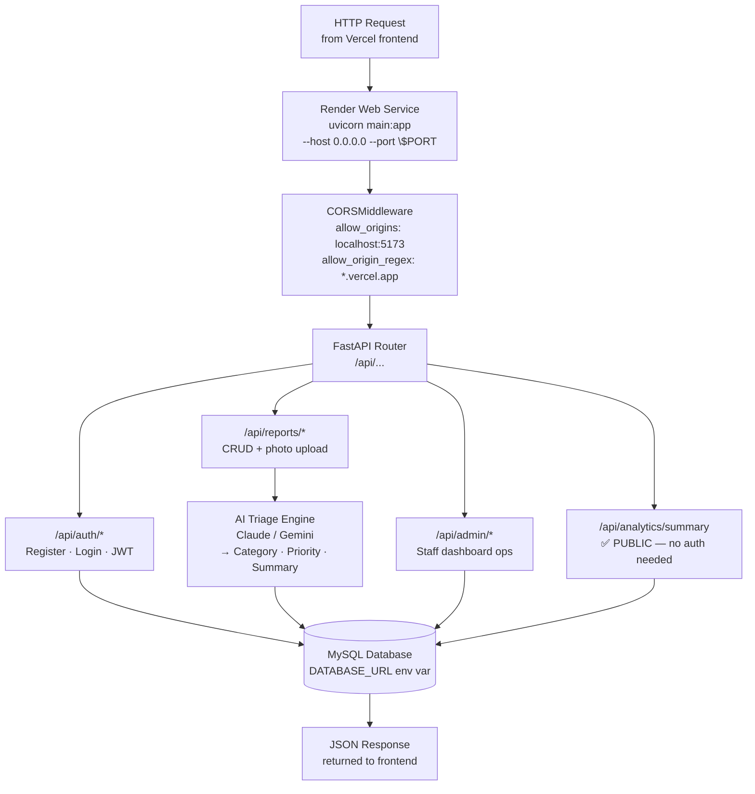
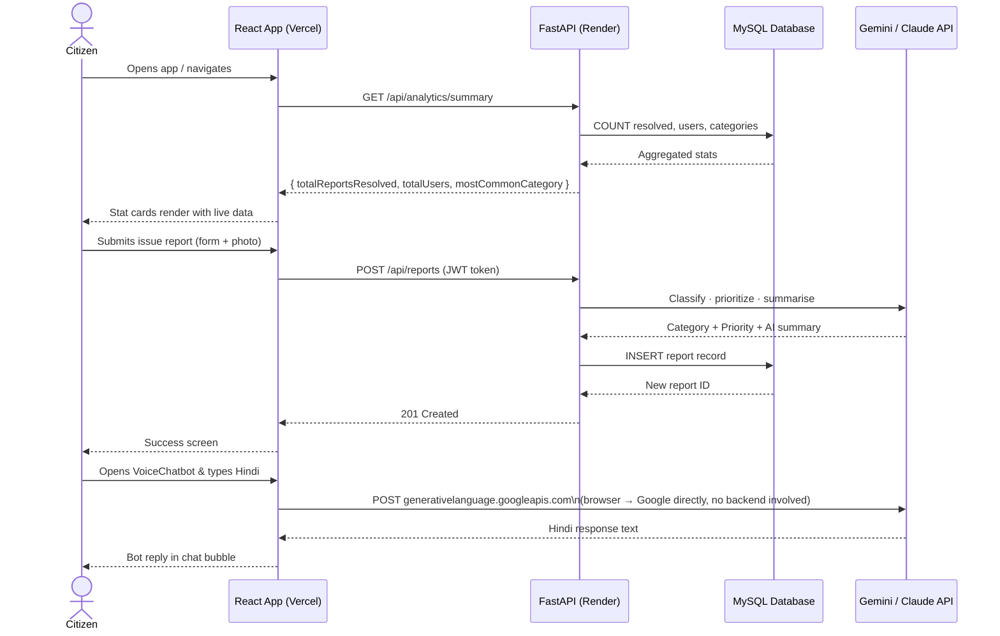

# CivilVerge — Backend & Frontend Pipelines

---

## 🖥️ Frontend Pipeline (React / Vite → Vercel)



---

## ⚙️ Backend Pipeline (FastAPI / Python → Render)



---

## 🔄 Full End-to-End Request Lifecycle



---

## 📁 Project File Structure

```
civil_verge/
├── client/                        ← Vercel deployment
│   ├── src/
│   │   ├── App.jsx                 ← Routes + global <VoiceChatbot />
│   │   ├── components/
│   │   │   └── VoiceChatbot.jsx    ← Gemini AI chatbot (browser-direct)
│   │   ├── pages/
│   │   │   ├── Landing.jsx         ← Live stats from /api/analytics/summary
│   │   │   ├── SubmitReport.jsx    ← Complaint form + AI triage
│   │   │   ├── MyReports.jsx       ← Status timeline
│   │   │   ├── AdminDashboard.jsx
│   │   │   └── Analytics.jsx
│   │   └── services/
│   │       └── api.js              ← Axios (baseURL = VITE_API_URL)
│   ├── .env.development            ← VITE_API_URL=http://localhost:8000
│   ├── .env.production             ← VITE_API_URL=https://civilverge-api.onrender.com
│   └── vercel.json                 ← SPA rewrites → index.html
│
└── server/                        ← Render deployment
    ├── main.py                     ← FastAPI app + CORS + routes
    ├── requirements.txt
    ├── render.yaml                 ← One-click Render config
    └── app/
        ├── routes/
        │   ├── auth.py
        │   ├── reports.py
        │   ├── admin.py
        │   └── analytics.py        ← Public /summary endpoint
        ├── models/
        ├── services/
        │   └── ai.py               ← Gemini/Claude triage
        └── middleware/
            └── auth.py             ← JWT verification
```
